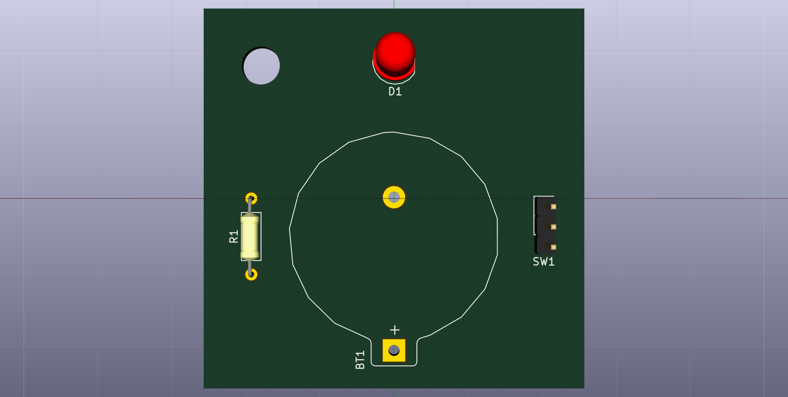
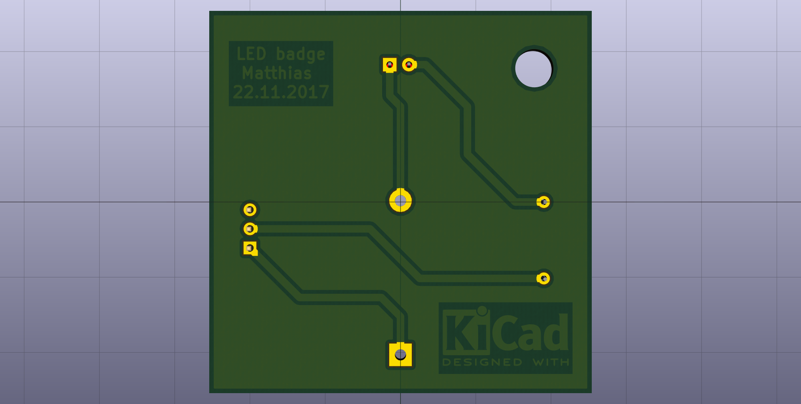
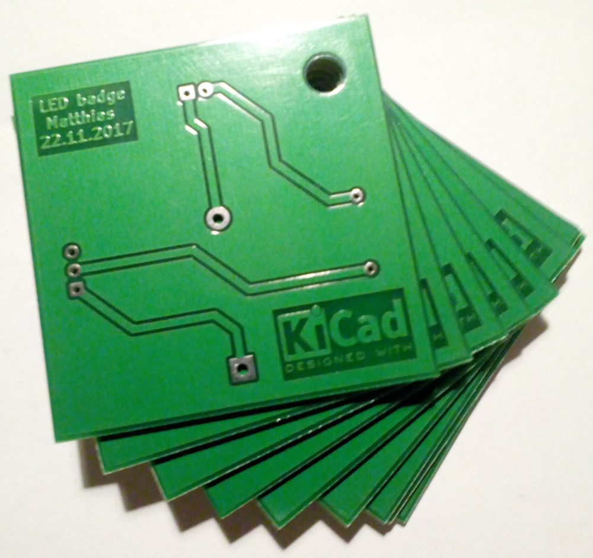

================
Simple LED badge
================

My first Kicad project. The copper layer is "optimized" for laser toner
transfer pcb making (As seen on Instructables_). As the original Kicad footprint
library "Symbols" only had the Kicad logo for the "Silk Screen" layer copied the
footprint to the projects and edited it for use on the copper layer.

Assembly instructions
---------------------

* First solder the resistor. Direction doesnt care.
* Solder the button cell holder fitting the print on the pcb.
* Solder the switch to the pcb. Direction does not care.
* The direction is important for the led. Take a close look: It should have a
  long and a short lead. The shorter lead is the negative lead and should go to
  the square solder pad. If you follow the trace from the square solder pad it
  ends in the middle of the pcb at the negative pin of the button cell holder.

Pictures
--------

.. _Instructables: http://www.instructables.com/id/Cheap-and-Easy-Toner-Transfer-for-PCB-Making/).

The pcbs produced by Smart-Prototyping.com_ . The price was ~10 € for ten pcbs
and shipping to Germany. Took all together (production, shipping, customs) 19 days. 

.. _Smart-Prototyping.com: https://www.smart-prototyping.com
